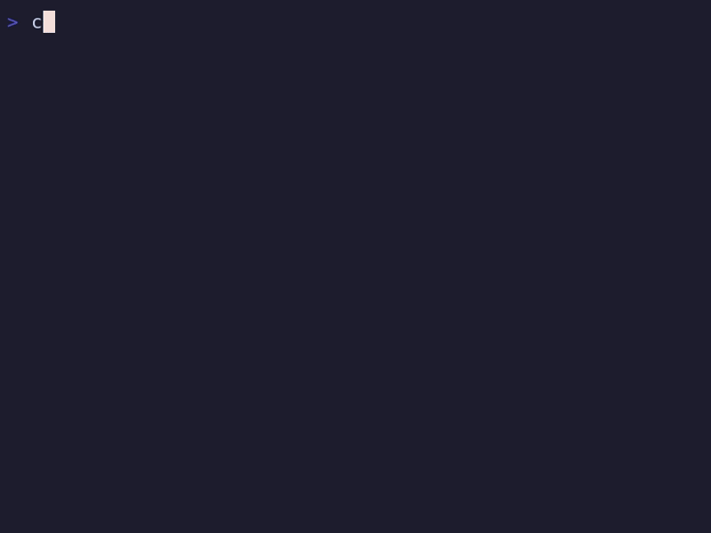

  
  <h3 align="center">Changie</h3>
  
Separate your changelog from commit messages without conflicts.

## Features
* File based changelog management keeps your commit history and release notes separate.
* Track changes while you work while the knowledge is fresh.
* Extensive [configuration options](https://changie.dev/config) to fit your project.
* Language and framework agnostic using a single go binary.

## Getting Started
* User documentation is available on the [website](https://changie.dev/).
* Specifically, the [guide](https://changie.dev/guide/) is a good place to start.
* There is also a [Changie GitHub Action](https://github.com/miniscruff/changie-action) available.
* Changie's [Changelog](CHANGELOG.md) is generated by itself.
* [Examples](./examples) contains a few configurations and video examples.

## Need help?
Use the [discussions page](https://github.com/miniscruff/changie/discussions) for help requests and how-to questions.

Please open [GitHub issues](https://github.com/miniscruff/changie/issues) for bugs and feature requests.
File an issue before creating a pull request, unless it is something simple like a typo.

## Want to Contribute?
If you want to contribute through code or documentation, the [Contributing guide](CONTRIBUTING.md) is the place to start.
If you need additional help create an issue or post on discussions.

## Semantic Version Compatibility
Changie is focused around the CLI and its configuration options and aims to keep existing CLI commands and options suported in major versions.
It is possible to use Changie as a dependent package but no support or compability is guaranteed.

## License
Distributed under the [MIT License](LICENSE).
