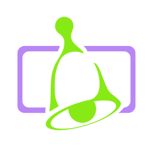

  
  <h3 align="center">Changie</h3>
  
Automate your changelogs without conflicts.

---

## Features
* File based changelog management keeps your commit history and release notes separate.
* Track changes while you work while the knowledge is fresh.
* Extensive [configuration options](https://changie.dev/config) to fit your project.
* Language and framework agnostic using a single go binary.

## Getting Started
* User documentation is available on the [website](https://changie.dev/).
* Specifically, the [guide](https://changie.dev/guide/) is a good place to start.
* View Changie's [Changelog](CHANGELOG.md) for an example.

## Need help?
Use the [discussions page](https://github.com/miniscruff/changie/discussions) for help requests and how-to questions.

Please open [GitHub issues](https://github.com/miniscruff/changie/issues) for bugs and feature requests.
File an issue before creating a pull request, unless it is something simple like a typo.

## Want to Contribute?
If you want to contribute through code or documentation, the [Contributing guide](CONTRIBUTING.md) is the place to start.
If you need additional help create an issue or post on discussions.

## License
Distributed under the [MIT License](LICENSE).
